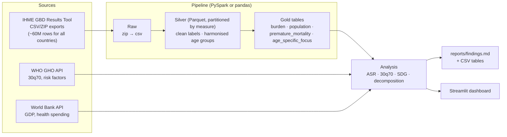

 🫀 NCD Burden Atlas: India vs the World

**A PySpark data pipeline and dashboard that measures how much non-communicable disease (heart disease, cancer, diabetes, chronic lung disease and others) costs India in lives and healthy years, how that compares with the rest of the world, and whether India is on track to meet its UN 2030 target.**


  

---

## Why this matters

Non-communicable diseases (NCDs) are now the world's biggest killer. According to the WHO, NCDs killed **at least 43 million people in 2021, 75% of all non-pandemic deaths**, and **18 million of them died before age 70; 82% of those premature deaths were in low- and middle-income countries** such as India ([WHO fact sheet, Sept 2025](https://www.who.int/news-room/fact-sheets/detail/noncommunicable-diseases)).

UN **Sustainable Development Goal 3.4** commits every country to *"reduce by one third premature mortality from NCDs"* by 2030. India has the world's largest population, a fast-ageing age structure and rising rates of diabetes and hypertension, so its progress moves the global number.

Headline counts can mislead. India has more NCD deaths than almost any country partly because it is **huge** and increasingly **older**, not only because its people are at higher risk. This project separates those effects with standard epidemiological methods.

## Questions this project answers

| # | Question | Method |
|---|----------|--------|
| 1 | How large is India's NCD burden compared with the world's? | Deaths, DALYs, **age-standardised rates** |
| 2 | Which diseases drive the gap? | Cause-level age-standardised DALY rates, India ÷ World ratio |
| 3 | How fast is India's disease burden shifting from infections to chronic disease? | NCD share of all DALYs, 1990 → today |
| 4 | Is India on track for SDG 3.4? | **30q70** (SDG indicator 3.4.1), trend projection to 2030 |
| 5 | Why are NCD deaths rising: more people, older people, or more risk? | **Three-factor Shapley decomposition** |
| 6 | Early death or living with illness? | YLL vs YLD split, share of NCD deaths before 70 |
| 7 | How unequal are Indian states? | State ranking on age-standardised rates and 30q70 |
| 8 | Given its income, is India doing better or worse than other countries? | WHO 30q70 vs World Bank GDP per capita, ~190 countries, regression residual |

## Architecture



**Two interchangeable engines.** The **Spark engine** handles full GBD exports (all 204 countries × 32 years × 20 age groups × 3 sexes × causes × measures, tens of millions of rows): broadcast joins for lookup tables, a Parquet silver layer partitioned by measure, and every calculation as a distributed `groupBy`. The **pandas engine** handles small extracts on any laptop. `engine: auto` chooses Spark when it is installed and the input exceeds 200 MB. **A parity test checks that both engines produce identical gold tables.**

## Quick start (5 minutes, no downloads)

```bash
git clone https://github.com/<your-username>/ncd-burden-india.git
cd ncd-burden-india
python -m venv .venv && source .venv/bin/activate      # Windows: .venv\Scripts\activate
make install                  # or: pip install -e ".[spark,dashboard,dev]"

ncdburden demo --size small   # ⚠️ SYNTHETIC data in the exact GBD export layout
ncdburden all                 # pipeline + report  → reports/findings.md
streamlit run dashboard/app.py
```

> The demo data is **synthetic**. It exists so you can run everything end to end offline and in CI. Every page and report built from it carries a "SYNTHETIC DEMO DATA" banner. **Don't quote its numbers.**

Or with Docker: `docker compose run --rm pipeline && docker compose up dashboard` → http://localhost:8501

## Getting the real data

### 1. IHME Global Burden of Disease (main dataset)

1. Create a free account at the **[GBD Results Tool](https://vizhub.healthdata.org/gbd-results/)**.
2. Select:

   | Field | Select |
   |---|---|
   | GBD estimate | Cause of death or injury |
   | Measure | Deaths, DALYs, YLDs, YLLs |
   | Metric | **Number** *and* **Rate** (both are needed: population is derived from their ratio) |
   | Cause | All causes; the 3 level-1 groups; every level-2 cause under *Non-communicable diseases*; *Diabetes mellitus* (needed for SDG 3.4.1) |
   | Location | Global, India, **India's states**, comparison countries (or *all countries and territories* for the big-data run) |
   | Age | `<5 years`, every 5-year group through `95+ years`, **All ages**, **Age-standardized** |
   | Sex | Male, Female, Both |
   | Year | 1990 → latest |

3. Download the ZIP files into `data/raw/gbd/` (don't unzip; the pipeline does that).
4. Run `ncdburden clean-demo` if you tried the demo, then `ncdburden all`.

Both GBD layouts (with or without `*_id` columns) are handled. So are under-5 fragments such as `<1 year` and `12-23 months`, which are summed into `0-4`.

> IHME data is free for non-commercial use with citation. Don't commit raw GBD files to GitHub (`data/` is already git-ignored).

### 2. WHO and World Bank (automatic)

```bash
ncdburden fetch     # WHO GHO OData API + World Bank API; no key needed
```

This pulls WHO's own 30q70 estimates for every country, risk factors (obesity, diabetes, hypertension and its control, tobacco, physical inactivity), GDP per capita (PPP), health spending and population age structure.

## Methods

**Age-standardised rate (ASR).** India's population is younger than the world's, so crude rates understate India's risk. Direct standardisation applies each population's age-specific rates to one fixed standard population (the WHO World Standard 2000–2025):

$$ASR = \sum_{a} r_a \cdot w_a \times 100{,}000$$

**Premature NCD mortality, 30q70 (SDG 3.4.1).** This is the probability that a 30-year-old dies before 70 from cardiovascular disease, cancer, diabetes or chronic respiratory disease, following the WHO method:

$${}_5q_x = \frac{5\,m_x}{1 + 2.5\,m_x}, \qquad {}_{40}q_{30} = 1 - \prod_{x=30}^{65}\left(1 - {}_5q_x\right)$$

**SDG progress.** The target is ⅔ of the 2015 value by 2030. The observed annual rate of change since 2015 is projected forward and compared with the rate required.

**Decomposition.** Deaths = N × Σₐ sₐ·rₐ (population size × age structure × age-specific rates). Each factor is switched from the start year to the end year in all 6 possible orders and the contributions are averaged (a Shapley decomposition), so the three parts add up **exactly** to the observed change.

**Validation.** The gold table stores both *our* ASR and *GBD's published* ASR. The report shows how closely they agree. They differ slightly because GBD uses its own standard population.

## Project structure

```
ncd-burden-india/
├── config/config.yaml          # paths, locations, engine, indicators
├── src/ncdburden/
│   ├── epi.py                  # ⭐ epidemiology maths (reference implementation)
│   ├── gbd.py                  # GBD vocabulary: ages, measures, causes, locations
│   ├── engines/
│   │   ├── spark_engine.py     # distributed implementation
│   │   └── pandas_engine.py    # in-memory implementation (tested for parity)
│   ├── pipeline.py             # raw → silver → gold orchestration
│   ├── analysis.py             # the 8 questions, as functions
│   ├── report.py               # findings.md + CSVs
│   ├── sources/who.py          # WHO GHO API client
│   ├── sources/worldbank.py    # World Bank API client
│   ├── demo.py                 # synthetic GBD-format data
│   └── cli.py                  # `ncdburden …`
├── dashboard/app.py            # Streamlit + Plotly, 7 tabs
├── tests/                      # known-answer, parity and end-to-end tests
├── .github/workflows/ci.yml    # lint + tests + Spark end-to-end on every push
├── Dockerfile, docker-compose.yml, Makefile
```

## Tests

```bash
pytest -q
```

* **Known-answer tests** check the epidemiology against hand-worked results. Examples: a constant rate gives the same ASR for any age structure; 30q70 at m = 0.004 is about 14.8%; the decomposition sums exactly and isolates each factor.
* **Parity tests** check that the Spark engine produces identical gold tables to the pandas engine.
* **End-to-end tests** run demo data through the pipeline and report, with WHO/World Bank parsing tested offline.

## Results

After running on real data, paste highlights from `reports/findings.md` here, for example:
- *NCDs caused X% of deaths in India in 20XX vs Y% worldwide.*
- *India's age-standardised NCD DALY rate is Z× the global rate, driven mainly by …*
- *At the current pace India's 30q70 reaches … by 2030 vs a target of … (on/off track).*
- *Of the rise in NCD deaths since 1990, …% came from population growth, …% from ageing, and …% from changes in age-specific risk.*

Add dashboard screenshots to `docs/` and link them here.

## Limitations

* GBD figures are **modelled estimates** with uncertainty intervals. This project reports central estimates; the `lower`/`upper` columns are kept in silver for extension.
* Our ASR uses the WHO standard population, so it differs slightly from GBD's published ASR (the difference is reported).
* The SDG projection assumes the 2015→latest trend continues. It is a "current pace" scenario, not a forecast.
* The income comparison is cross-sectional and correlational.

## Ideas to extend

* Attribute NCD burden to risk factors (GBD "risk factor" estimates): air pollution, blood pressure, diet, tobacco.
* Add uncertainty to 30q70 by running the formula on the lower and upper bounds.
* Link state-level burden to NFHS-5 survey data on hypertension and diabetes screening.
* Map the states using an India GeoJSON.

## Data sources & citation

* Global Burden of Disease Collaborative Network. *Global Burden of Disease Study Results.* Institute for Health Metrics and Evaluation (IHME), Seattle. https://vizhub.healthdata.org/gbd-results/
* World Health Organization. *Global Health Observatory.* https://www.who.int/data/gho
* World Bank. *World Development Indicators.* https://data.worldbank.org
* Ahmad OB et al. *Age standardization of rates: a new WHO standard.* GPE Discussion Paper No. 31, WHO, 2001.

## License

MIT. See [LICENSE](LICENSE). Data remains subject to each provider's terms.
